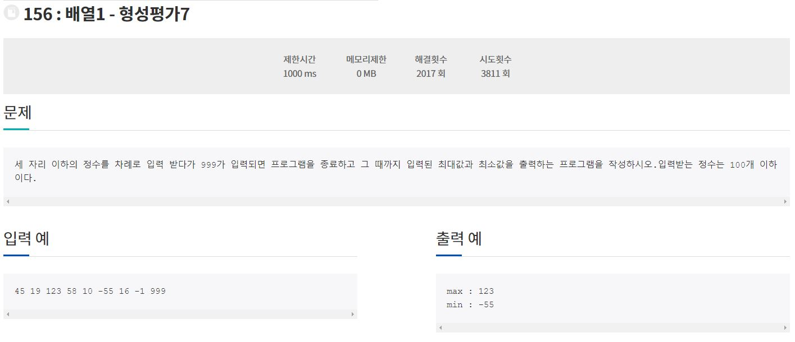

### 210925_Algorithm(정올156번)

1. 문제



2. 코드구현

```java
import java.util.Scanner;

class Main{
	public static void main(String[] args){
		Scanner sc = new Scanner(System.in);
		int input = sc.nextInt();
		int max = input;
		int min = input;
		while(true){
			input = sc.nextInt();
			if(input == 999){
				break;
			}
			if(input < min){
				min = input;
			}
			if(input > max){
				max = input;
			}
		}
		System.out.println("max : " + max);
		System.out.println("min : " + min);
	}
}
```

