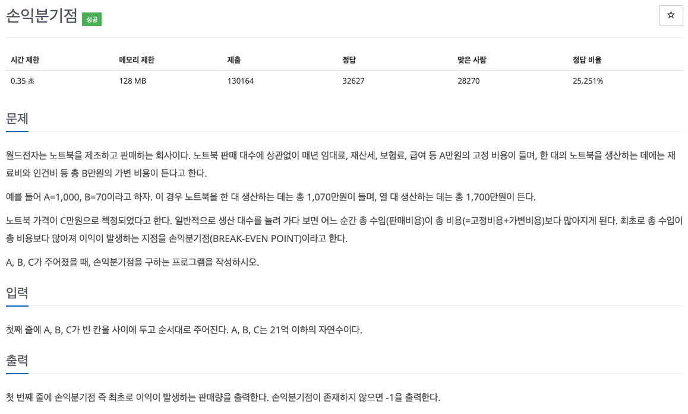

210926_Algorithm(백준1712번)

1. 문제

   

2. 코드구현

   ```java
   import java.util.Scanner;
   
   class Main{
       public static void main(String[] args){
           Scanner sc = new Scanner(System.in);
           int A = sc.nextInt();
           int B = sc.nextInt();
           int C = sc.nextInt();
           int count = 0;
           if(B >= C){
               System.out.println(-1);
           }else{
               while(A >= 0){
                   A -= (C - B);
                   count++;
               }
               System.out.println(count);
           }
       }
   }
   ```