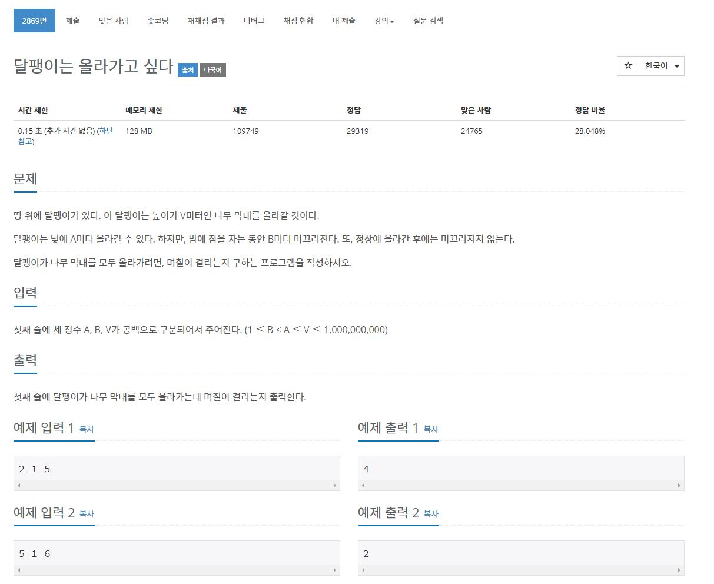

210927_Algorithm

1. 문제

   

2. 코드구현

   ```java
   import java.util.*;
   import java.io.*;
   
   class Main{
       public static void main(String[] args) throws IOException{
           BufferedReader br = new BufferedReader(new InputStreamReader(System.in));
           StringTokenizer st = new StringTokenizer(br.readLine(), " ");
           int A = Integer.parseInt(st.nextToken());
           int B = Integer.parseInt(st.nextToken());
           int V = Integer.parseInt(st.nextToken());
           int result = 0;
           result = (V - B) / (A - B);
           if((V - B) % (A - B)){
               result++;
           }
           System.out.println(result);
       }
   }
   ```

   3. 풀이
      - 시간단축을 위해서는 Scanner보다 BufferedReader가 좋다.
      - 반복문은 시간초과의 원인이다.
