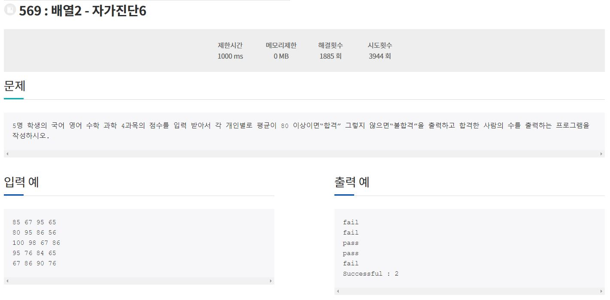

210929_Algorithm(정올569번)

1. 문제

   

2. 구현

   ```java
   import java.util.Scanner;
   
   class Main{
   	public static void main(String[] args){
   		Scanner sc = new Scanner(System.in);
   		int[] arr = new int[5];
   		for(int i = 0; i < arr.length; i++){
   			int sum = 0;
   			for(int j = 0; j < 4; j++){
   				sum += sc.nextInt();
   			}
   			arr[i] = sum/4;
   		}
   		int count = 0;
   		for(int i = 0; i < arr.length; i++){
   			if(arr[i] >= 80){
   				System.out.println("pass");
   				count++;
   			}else{
   				System.out.println("fail");
   			}
   		}
   		System.out.println("Successful : " + count);
   	}
   }
   ```

   