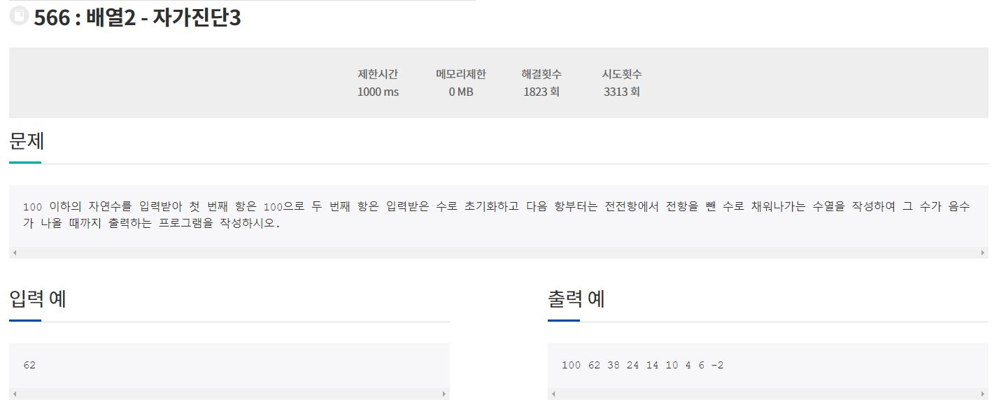

210930_Algorithm(정올566번)

1. 문제

   

2. 코드구현

   ```java
   import java.util.Scanner;
   
   class Main{
   	public static void main(String[] args){
   		Scanner sc = new Scanner(System.in);
   		int[] arr = new int[100];
   		arr[0] = 100;
   		arr[1] = sc.nextInt();
   		System.out.println(arr[0]);
   		System.out.println(arr[1]);
   		for(int i = 2; i < arr.length; i++){
   			arr[i] = arr[i-2] - arr[i-1];
   			if(arr[i] < 0){
   				System.out.println(arr[i]);
   				break;
   			}else{
   				System.out.println(arr[i]);
   			}
   		}
   	}
   }
   ```

   