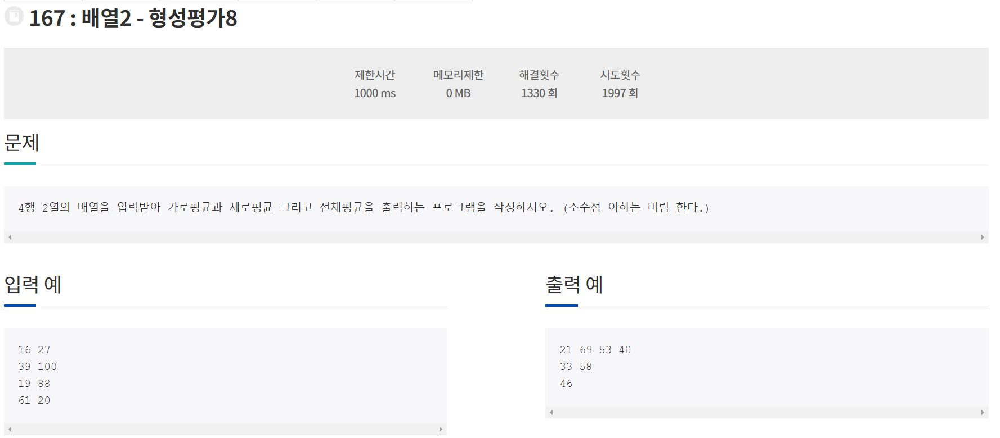

211001_Algorithm(정올 167번)

1. 문제

   

2. 코드구현

   ```java
   import java.util.Scanner;
   
   class Main{
   	public static void main(String[] args){
   		Scanner sc = new Scanner(System.in);
   		int[][] arr = new int[4][2];
   		for(int i = 0 ; i < arr.length; i++){
   			for(int j = 0; j < arr[i].length; j++){
   				arr[i][j] = sc.nextInt();
   			}
   		}
   		int sum = 0;
   		int sum2 = 0;
   		for(int i = 0; i < arr.length; i++){
   			sum = 0;
   			for(int j = 0; j < arr[j].length; j++){
   				sum += arr[i][j];
   				sum2 += arr[i][j];
   			}
   			System.out.println(sum/2);
   		}
   		for(int i = 0; i < arr[i].length; i++){
   			sum = 0;
   			for(int j = 0; j < arr.length; j++){
   				sum += arr[j][i];
   			}
   			System.out.println(sum/4);
   		}
   		System.out.println(sum2/8);
   	}
   }
   ```

   