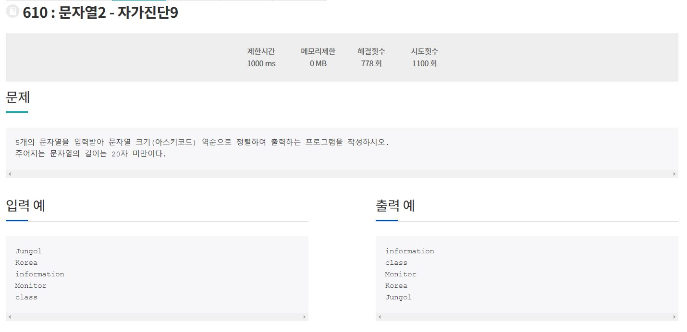

### 211003_Algorithm(정올 610번)

1. 문제

   

2. 코드구현

   ```java
   import java.util.*;
   
   class Main{
   	public static void main(String[] args){
   		Scanner sc = new Scanner(System.in);
       String[] arr = new String[5];
       String temp = "";
       for(int i = 0 ; i < arr.length; i++){
         arr[i] = sc.nextLine();
       }
       for(int i = 0; i < arr.length - 1; i++){
         for(int j = i + 1; j < arr.length; j++){
           if(arr[i].compareTo(arr[j]) < 0){
             temp = arr[j];
             arr[j] = arr[i];
             arr[i] = temp;
           }
         }
       }
       for(int i = 0 ; i < arr.length; i++){
         System.out.println(arr[i]);
       }
     }
   }
   ```

3. 풀이

   - 정렬문제는 여러가지 방법으로 풀 수 있음
   - Array나 Collection에서 제공하는 메서드를 사용해서 풀면 쉽지만 시간초과가 발생할 수 있기 때문에 여러가지 정렬 방법을 공부하는 것이 좋음
   - 위의 코드는 정렬의 가장 기본이 되는 버블정렬을 사용하였음
   - 추후 추가적인 정렬 알고리즘에 대한 문제를 풀어볼 필요가 있음