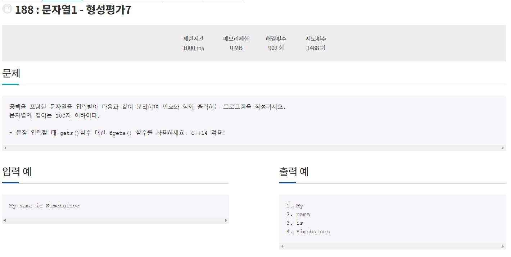

### 211004_Algorithm(jungol188번)

1. 문제

   

2. 코드구현

   ```java
   import java.util.*;
   
   class Main{
   	public static void main(String[] args){
   		Scanner sc = new Scanner(System.in);
   		String[] arr = sc.nextLine().split(" ");
   		for(int i = 0; i < arr.length; i++){
   			System.out.println(i+1 + ". " + arr[i]);
   		}
   	}
   }
   ```

3. 문자열을 나누는 방법은 String에서 제공하는 split() 메서드를 사용하면 쉽게 나눌 수 있다.