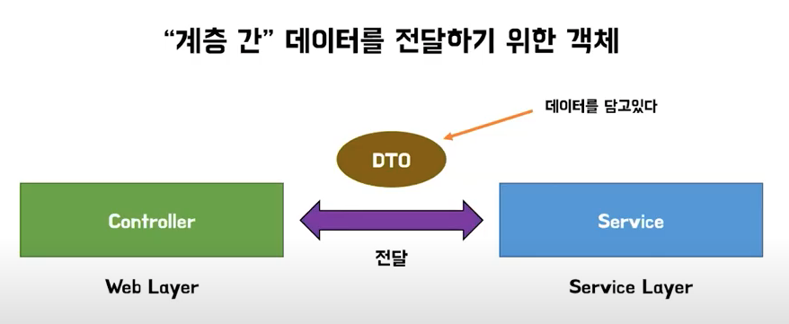
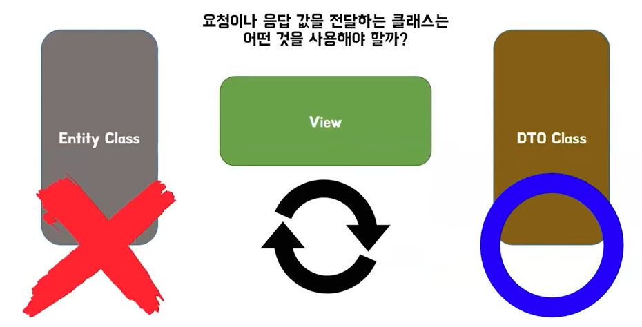
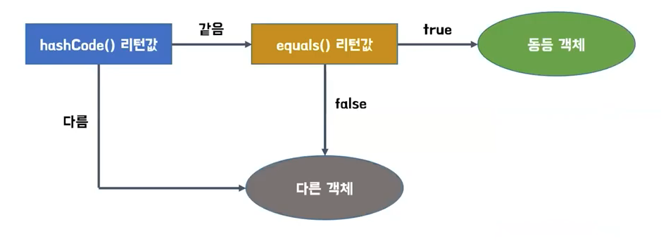
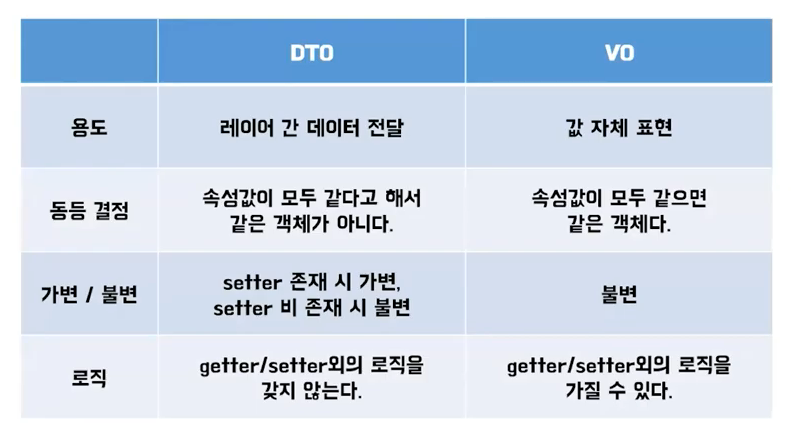

### DTO vs VO

1. DTO란?

   - 정의

     1. Data Transfer Object
     2. 데이터 전달용 객체, 데이터를 담아서 전달하는 바구니
     3. 계층(레이어) 간 데이터를 전달하기 위한 객체

     

     

   - 특징

     1. 오직 getter/setter 메서드만을 갖음
     2. 다른 로직을 갖지 않음
     3. 데이터를 전달하는 Service Layer는 setter를 사용, 데이터를 전달받는 Web Layer는 getter를 사용

   - 불변객체로의 확장

     1. setter 메서드로 객체의 값을 변경하는 것을 방지하기 위해 DTO의 필드를 final로 선언
     2. 생성자를 통해 필드의 값들을 초기화해서 보내면 전달과정 중 값이 변경되지 않는 것을 보장할 수 있음 -> 데이터 불변성 보장

   - DTO Class와 Entity Class의 분리

     1. Entity Class는 값을 요청하거나 전달하는 클래스로 사용해서는 안됨
     2. Entuty Class는 DB와 연결되어 있는 핵심 클래스이고 DB테이블 생성, 스키마의 기준이 됨
     3. 요청이나 응답은 반드시 DTO Class를 사용해야 됨

     

2. VO란?

   - 정의

     1. Value Object
     2. 값 그 자체를 표현하는 객체
     3. 값으로만 비교되는 객체 ex) 돈

   - 특징

     1. 값 자체를 표현하기 때문에 불변객체
     2. 클래스의 필드는 final로 선언, 생성자로 필드 초기화
     3. DTO와 달리 getter, setter 메서드 이외의 메서드도 포함 가능
     4. 값 자체를 비교하는 것이기 때문에 hashCode와 equals를 재정의 해야됨

     

3. 결론

   ​		

***

자료출처 : YouTube ['우아한Tech [10분 테코톡] 인비의 DTO vs VO'](https://www.youtube.com/watch?v=z5fUkck_RZM)