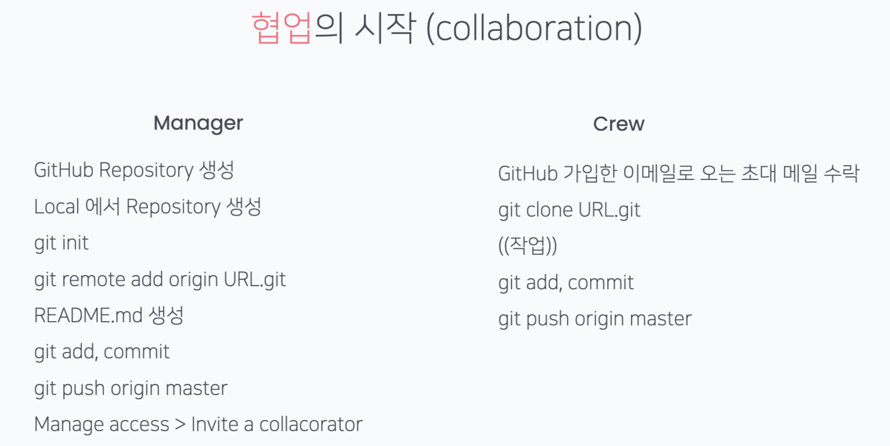
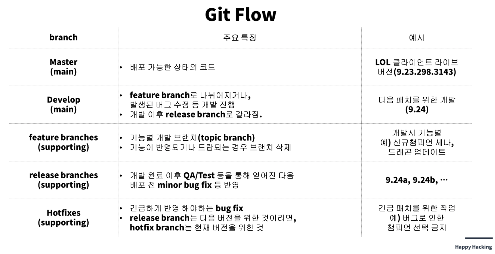
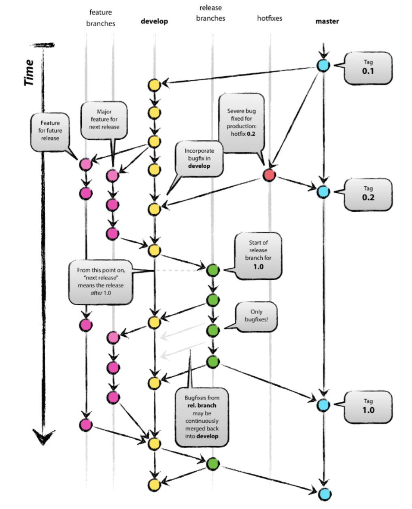
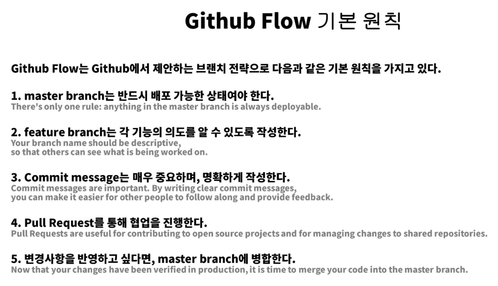

# Git?

1. Git (분산 버전 관리 시스템) VS GitHub
   - Git
     1. 코드의 히스토리(버전)을 관리하는 도구
     2. 개발되어온 과정 파악 가능
     3. 이전 버전과의 변경 사항 비교 및 분석
     4. 변경 사항만을 저장 -> 용량 부담이 적다 = 가볍다
   - GitHub (Git 기반의 저장소 서비스)

2. Unix/Linux 기본 명령어
   - 현재 위치의 폴더, 파일 목록보기 : ls
   - 현재 위치 이동하기 cd<path>, cd .. (상위 폴더로 이동)
   - 폴더 생성하기 : mkdir<name>
   - 파일 생성하기 : touch<name>
   - 삭제하기 : rm<name>, rm -r<name>

3. Repository
   - 특정 디렉토리를 버전 관리하는 저장소
   - '특정 버전'으로 남긴다 = '커밋(commit)'한다
   - commit은 3가지 영역을 바탕으로 동작
     1. Working Directory : 내가 작업하고 있는 실제 디렉토리, .git이 있는 디렉토리
     2. Staging Area : commit으로 남기고 싶은, 특정 버전으로 관리하고 싶은 파일이 있는 곳
     3. Repository : commit들이 저장되는 곳

4. git 명령어

   - git init : Local Repository 생성
   - git status : 현재 git으로 관리되고 있는 파일들의 상태 확인

   - git add 파일이름 : 추적되지 않은 모든 파일과 추적하고 있는 파일 중 수정 된 파일을 Staging Area에 올리는 것, git add .은 모든 파일을 Staging Area에 올림
   - git log : git의 commit history 보기
   - git diff : 두 commit 간의 차이 보기
   - git config --global --list : 깃 사용자 정보 확인
   - git remote rm {local repo} : remote 삭제
   - git pull : remote에서 local로 코드를 가져오는 것
   - git restore --staged{file} : add한 파일을 취소하는 것
   - git restore {file} : Working Directory 변경사항 취소하기 (내 시간도 '취소'될 수 있으니까 조심해서 사용 -> 가장 최신 commit 상태로 돌리는 것)
   - git reset --hard(mixed, soft) {c_id} : commit을 돌리는 것, hard 옵션은 Working Directory, Staging Area, repo을 모두 해당 commit으로 되돌림, mixed는 Staging Area, repp만 해당 commit으로, soft는 repo만 해당 commit의  상태로 되돌림)
   - git rebase
   - git ignore : 원하지 않는 파일 제외하기, local repo생성 후 만들기, gitignore.io에서 ignore파일 기초 템플릿 생성 가능
   - git log --graph
   - git log --graph --oneline

5. Remote Repository 연결
   - git remote add origin {remote_repo} : local과 remote_repo 연결
   - git push -u origin master (origin - remote, master - local) : remote_repo와 branch 연결
   - git clone {remote_repo} : remote repo를 local로 복사

6. git 프로필 설정 : repository 이름을 사용자와 동일하게 설정, README.md 작성하면 profile로 사용가능

7. [Hits](https://hits.seeyoufarm.com/) : 방문자수 기록하는 기능

8. [GitHub Stats Card](https://github.com/anuraghazra/github-readme-stats)

9. Github Pages : Github에서 제공하는 무료 웹 호스팅 서비스, Github repo와 직접적으로 연동되어 있어 일정시간 후에 자동 반영(push하면 즉각 반영), 각각이 repo마다 pages를 만들 수 있음

10. Github Collaboration(협업)

- 브랜치(Branch) : 특정 커밋을 가리키는 '포인터'
  1. 브랜치 생성 : git branch {branch name}
  2. 브랜치 이동 : git checkout {branch name}
  3. 브랜치 생성 및 이동 : git checkout -b {branch name}
  4. 브랜치 목록 : git branch
  5. 브랜치 삭제 : git branch -d {branch name}
  6. 브랜치는 만들어야하나? 라는 고민이 들 때 무조건 만드는 것을 추천!
- (Branch) merge : 각 branch에서 작업을 한 후 이력을 합치기 위한 명령어
  1. fast forward merge : 기존 master에 변경사항이 없어 단순히 앞으로 이동
  2. merge commit case : master에 변경사항이 생겼을 경우 master를 commit한 후에 브랜치와 merge해야 됨
  3. collaboration with PR : pull request -> new pull request -> master 확인 후 merge
- Git Flow : Git을 활용하여 협업하는 흐름으로 branch를 활용하는 전략을 의미함. Github Flow, Gitlab Flow도 있음

 1. Shared Reposiroty Model : 해당 프로젝트 저장소에 직접적인 Push 권한 있음

 2. Fork and Pull Model : 해당 프로젝트 저장소에 직접적인 Push 권한 없음

    - remote repo 생성
    - Fork

    - loacl repo로 clone
    - branch 생성해서 작업 후 push
    - base repo master에게 PR

---

사진출처 : HPHK GIT/GITHUB 특강 자료
