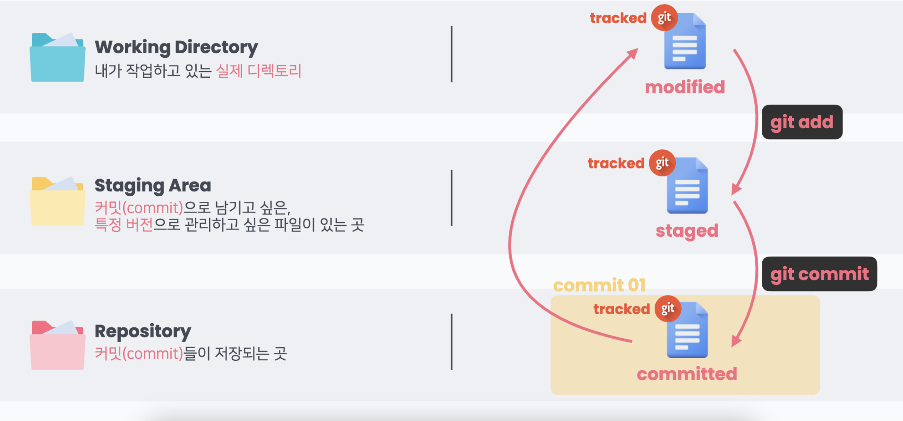
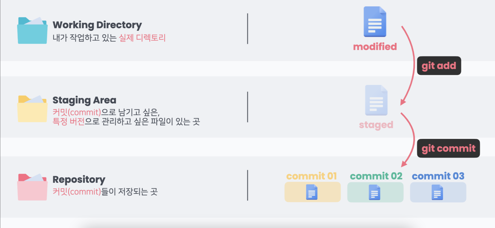

# Git?

1. Git (분산 버전 관리 시스템) VS GitHub
   - Git
     1. 코드의 히스토리(버전)을 관리하는 도구
     2. 개발되어온 과정 파악 가능
     3. 이전 버전과의 변경 사항 비교 및 분석
     4. 변경 사항만을 저장 -> 용량 부담이 적다 = 가볍다
   - GitHub (Git 기반의 저장소 서비스)

2. Unix/Linux 기본 명령어
   - 현재 위치의 폴더, 파일 목록보기 : ls
   - 현재 위치 이동하기 cd<path>, cd .. (상위 폴더로 이동)
   - 폴더 생성하기 : mkdir<name>
   - 파일 생성하기 : touch<name>
   - 삭제하기 : rm<name>, rm -r<name>

3. Repository
   - 특정 디렉토리를 버전 관리하는 저장소
   - '특정 버전'으로 남긴다 = '커밋(commit)'한다
   - commit은 3가지 영역을 바탕으로 동작
     1. Working Directory : 내가 작업하고 있는 실제 디렉토리, .git이 있는 디렉토리
     2. Staging Area : commit으로 남기고 싶은, 특정 버전으로 관리하고 싶은 파일이 있는 곳
     3. Repository : commit들이 저장되는 곳

4. git 명령어
   - git status : 현재 git으로 관리되고 있는 파일들의 상태 확인
   - git add 파일이름 : 추적되지 않은 모든 파일과 추적하고 있는 파일 중 수정 된 파일을 Staging Area에 올리는 것, git add .은 모든 파일을 Staging Area에 올림
   - git log : git의 commit history 보기
   - git diff : 두 commit 간의 차이 보기
   - git config --global --list : 깃 사용자 정보 확인

5. Remote Repository 연결
   - git remote add origin {remote_repo} : local과 remote_repo 연결
   - git push -u origin master (origin - remote, master - local) : remote_repo와 branch 연결
   - git clone {remote_repo} : remote repo를 local로 복사

---

사진 출처 : HPHK GIT/GITHUB 특강 자료

