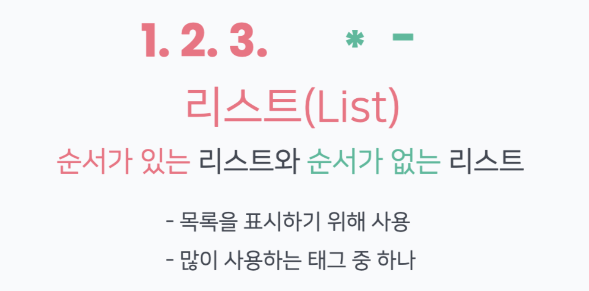
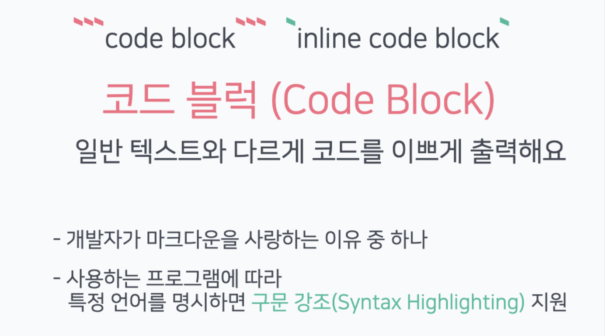
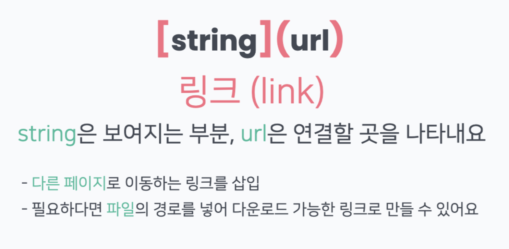
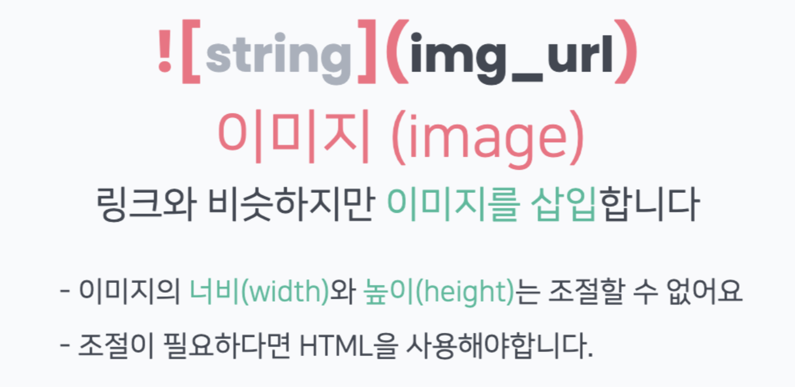
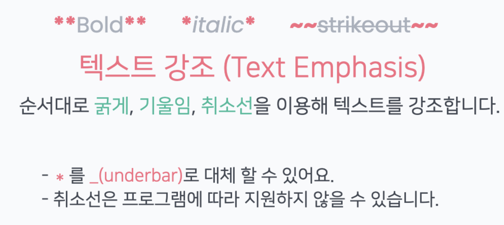
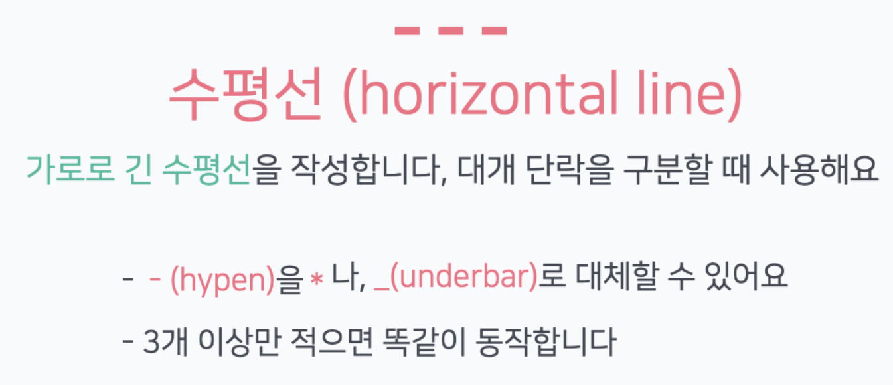
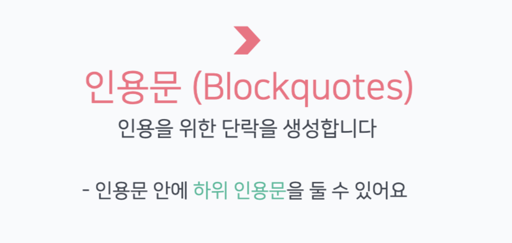
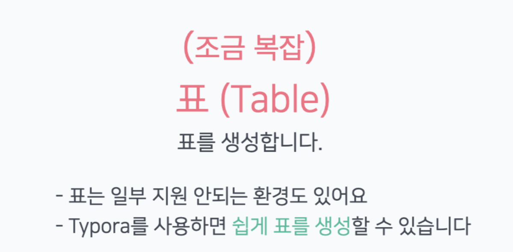

# 헤딩(#)


- 문서의 제목이나, 소제목을 나타내는 태그
- #의 개수로 헤딩 크기 설정 가능

# 리스트



- 순서가 없는 항목 1
- 순서가 없는 항목 2
- 순서가 없는 항목 3

1. 순서가 있는 항목 1
2. 순서가 있는 항목 2
3. 순서가 있는 항목 3

# 코드블럭



- 코드블럭(```code block```)

```
import time
time.sleep(60)
```

- 언어 설정(syntax highlighting)

```java
System.out.prinltn("Hello java");
```

- 인라인(`inline`) 코드블럭

일반 텍스트와 `code` 코드를 같이 적을 때 사용합니다.

# 링크



[Google](https://google.com)

# 이미지




# 텍스트강조



## 굵은 글씨

**Bold**

__Bold__

----

## 기울임체

*italic*

_italic_

---

## 취소선

~~strikcout~~

___

# 수평선



---

***

___


# 인용문



> 인용 단락
>
> > 인용의 인용

# 표



| 헤더 01 | 헤더 |
| ------- | ---- |
|         |      |

|      |      |      |
| ---- | ---- | ---- |
|      |      |      |
|      |      |      |
|      |      |      |


---

사진출처 : HPHK GIT/GITHUB 특강 자료
