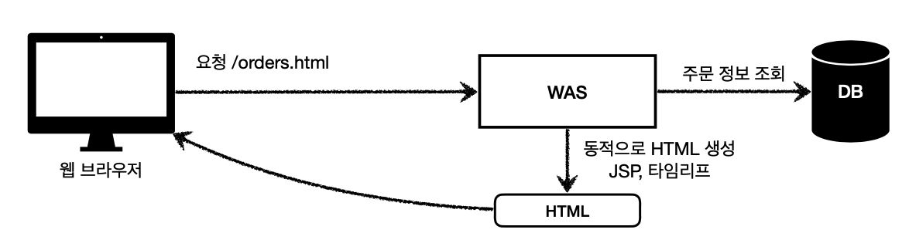
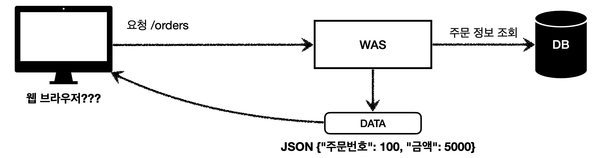
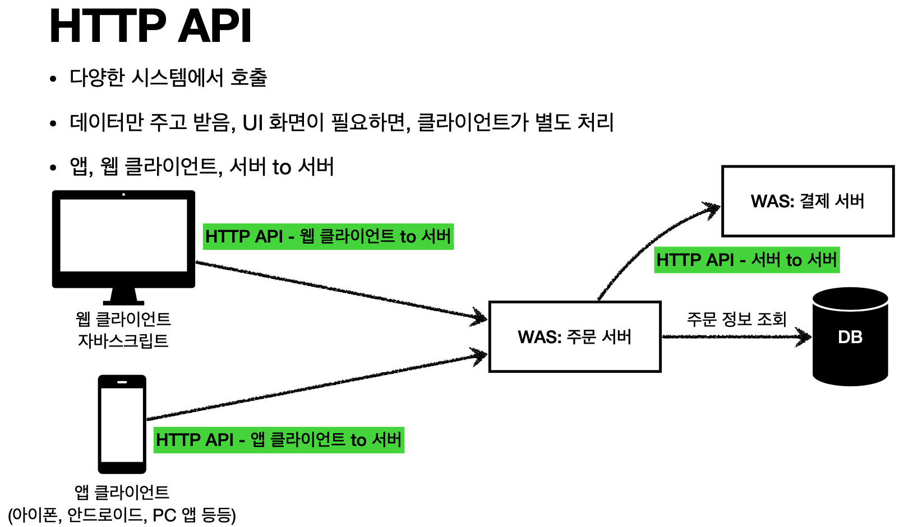
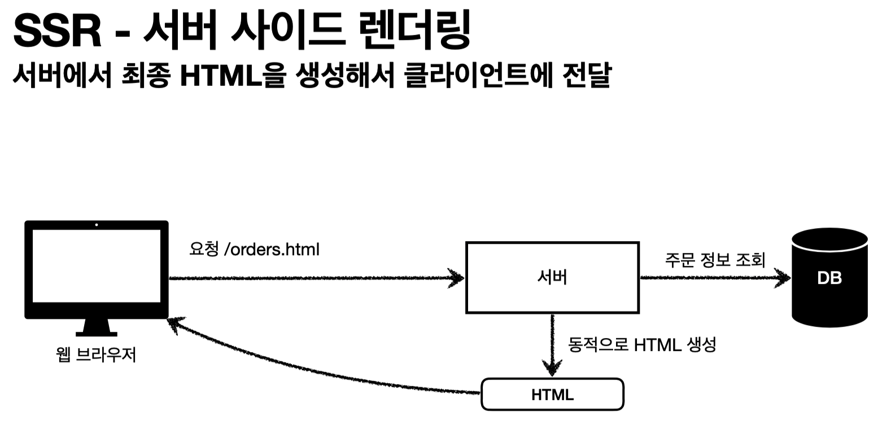
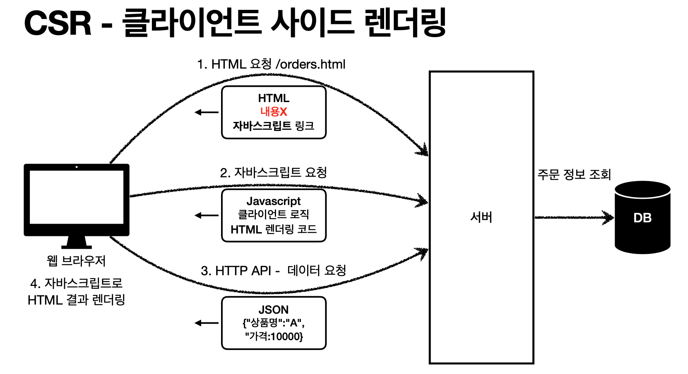

### HTML, HTTP API, CSR, SSR

1. HTML

   - 동적으로 필요한 HTML 파일을 생성해서 전달
   - 웹 브라우저 : HTML 해석

   

2. HTTP API

   - 특징
     1. HTML이 아니라 데이터를 전달
     2. 주로 JSON 형식 사용
     3. 다양한 시스템에서 호출
     4. 데이터만 주고 받음, UI 화면이 필요하면 클라이언트가 별도 처리
     5. 앱, 웹 클라이언트, 서버 to 서버

   

   

   - 다양한 시스템 연동
     1. 주로 JSON 형태로 데이터 통신
     2. UI 클라이언트 접점
        - 앱 클라이언트(아이폰, 안드로이드, PC 앱)
        - 웹 브라우저에서 자바 스크립트를 통한 HTTP API 호출
        - React, Vue.js 같은 웹 클라이언트
     3. 서버 to 서버
        - 주문 서버 -> 결제 서버
        - 기업 간 데이터 통신

3. 서버 사이드 렌더링, 클라이언트 사이드 렌더링

   - SSR - 서버 사이드 렌더링
     1. HTML 최종 결과를 서버에서 만들어서 웹 브라우저에 전달
     2. 주로 정적인 화면에 사용
     3. 관련기술 : JSP, 타임리프 -> 백엔드 개발자

   - CSR - 클라이언트 사이드 렌더링
     1. HTML 결과를 자바 스크립트를 사용해 웹 브라우저에서 동적으로 생성해서 적용
     2. 주로 동적인 화면에 사용, 웹 환경을 마치 앱처럼 필요한 부분을 변경할 수 있음 예) 구글 지도, Gmail, 구글 캘린더
     3. 관련기술 : React, Vue.js -> 웹 프론트엔드 개발자

   - 참고
     1. React, Vue.js를 CSR + SSR 동시에 지원하는 웹 프레임워크도 있음
     2. SSR을 사용하더라도 자바 스크립트를 사용해서 화면 일부를 동적으로 변경 가능

   

   

***

자료출처 : 인프런 스프링 MVC 1편 - 백엔드 웹 개발 핵심 기술