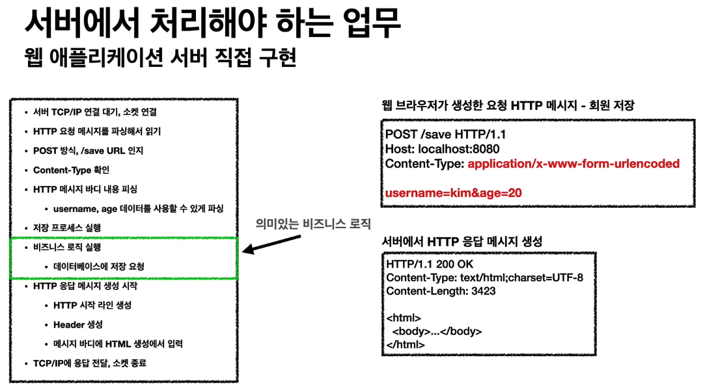
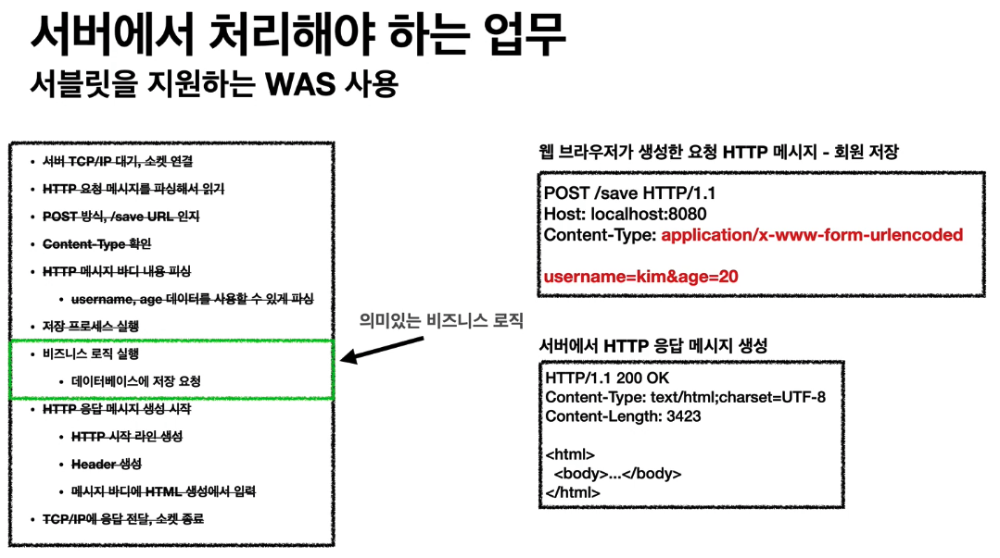
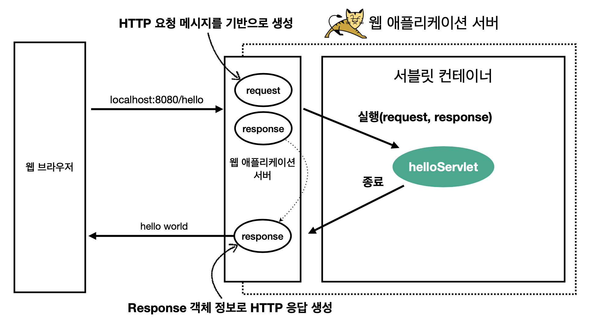
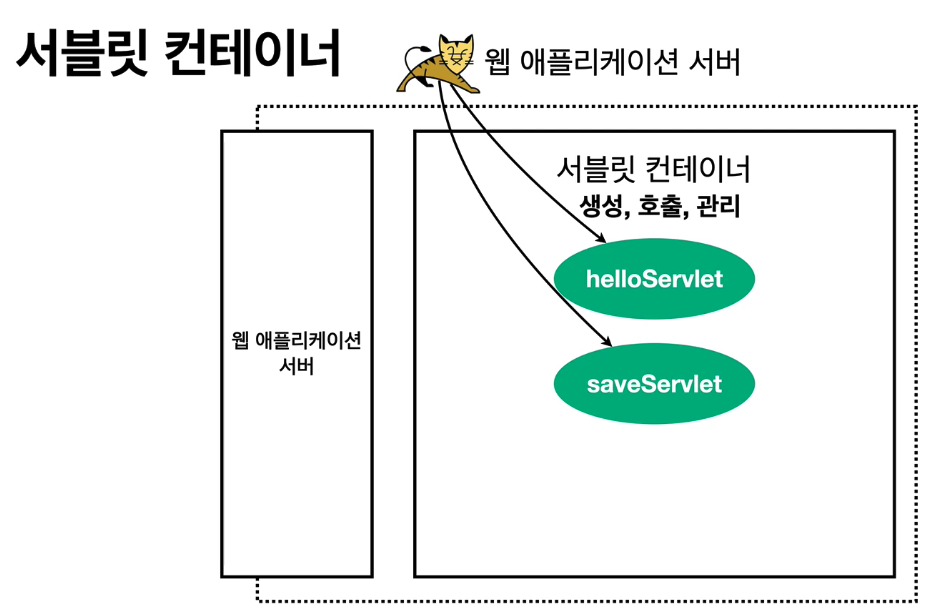

### 서블릿

1. 서버에서 업무 처리

   

   

2. 서블릿

   - 위의 과정을 간소화 시켜주는 것

   ```java
   @WebServlet(name = "helloServlet", urlPatterns = "/hello")
   public class HelloServlet extends HttpServlet{
     @Override
     protected void service(HttpServletRequest request, HttpServletResponse response){
       // 애플리케이션 로직
     }
   }
   ```

   - 특징
     1. urlPatterns(/hello)의 URL이 호출되면 서블릿 코드가 실행
     2. HTTP 요청 정보를 편리하게 사용할 수 있는 HttpServletRequest
     3. HTTP 응답 정보를 편리하게 제공할 수 있는 HttpServletResponse
     4. 개발자는 HTTP 스펙을 매우 편리하게 사용

   

   - HTTP 요청, 응답 흐름
     1. HTTP 요청 시
        - WAS는 Request, Response 객체를 새로 만들어서 서블릿 객체 호출
        - 개발자는 Request 객체에서 HTTP 요청 정보를 편리하게 꺼내서 사용
        - 개발자는 Response 객체에서 HTTP 응답 정보를 편리하게 입력
        - WAS는 Response 객체에 담겨있는 내용으로 HTTP 응답 정보를 생성

   - 서블릿 컨테이너

   

   1. 톰캣처럼 서블릿을 지원하는 WAS를 서블릿 컨테이너라고 함
   2. 서블릿 컨테이너는 서블릿 객체를 생성, 초기화, 호출, 종료하는 생명주기 관리
   3. 서블릿 객체는 싱글톤으로 관리
      - 고객의 요청이 올 때 마다 계속 객체를 생성하는 것은 비효율
      - 최초 로딩 시점에 서블릿 객체를 미리 만들어두고 활용
      - 모든 고객 요청은 동일한 서블릿 객체 인스턴스에 접근
      - **공유 변수 사용 주의**
      - 서블릿 컨테이너 종료 시 함께 종료
   4. JSP도 서블릿으로 변환되어서 사용
   5. 동시 요청을 위한 멀티 쓰레드 처리 지원
   6. [쓰레드](https://github.com/pjaemyung91/TIL/blob/master/springboot/lecture/thread.md)

***

자료출처 : 인프런 스프링 MVC 1편 - 백엔드 웹 개발 핵심 기술

