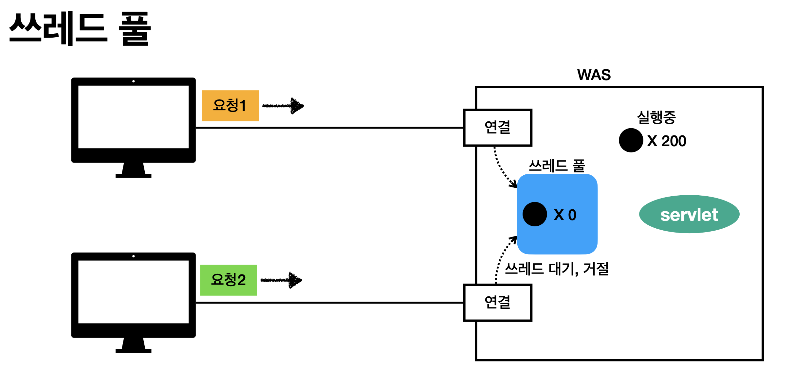

### thread

1. thread

   - process : 실행 중인 프로그램, 프로그램이 실행되면 OS로부터 메모리를 할당받아 프로세스가 상태가 됨

   - thread : 하나의 프로세스는 하나 이상의 thread를 가지게 되고 실제 작업을 수행하는 단위는 thread임 -> 하드디스크에 있는 프로그램을 실행히시면 메모리를 점령(process), 그 후에 CPU를 점유해야 수행이 됨, CPU를 점유하는 단위가 thread임

   

2. multi-thread

   - multi-thread : 여러 thread가 동시에 수행되는 프로그래밍, 여러 작업이 동시에 실행되는 효과

   - context : thread 각각의 작업 공간

   - 여러 thread 사이에서 공유하는 자원이 있을 수 있음(자바에서는 static instance)

   - 여러 thread가 자원을 공유하여 작업이 수행되는 경우 서로 자원을 차지하려는 race condition이 발생할 수 있음

   - 여러 thread가 공유하는 자원 중 경쟁이 발생하는 부분을 critical section이라고 함

     -> critical section에 대한 동기화(순차적인 실행)를 구현하지 않으면 오류가 발생할 수 있음

3. thread 관련 기능

   - thread 구현 : Thread 클래스를 상속받아서 구현하면 됨, 이미 다른 클래스를 상속받고 있다면 Runnable 인터페이스를 implements해서 run 메소드를 구현하면 됨

   - thread에 매개변수로 string을 넣으면 thread의 이름이 됨

     ex) Thread thread = new Thread("A") -> A라는 thread

   - synchronized

     1.  shared resource에 lock을 거는 방식

     2. 방법
        - 메소드에 synchronized 키워드 작성
        - synchronized 블럭 작성 -> 매개변수로 객체 입력
        - thread에 작성 -> run 메소드에 synchronized

   - Runnable풀에 있는 thread들은 언제든지 Run(cpu를 점령)할 수 있음
   - sleep, wait, join메소드를 통해 thread를 Not Runnable로 만들 수 있음
   - sleep(시간)은 시간이 지나면 Runnable상태로 돌아옴
   - wait은 notify를 통해 Runnable상태로 돌아옴, resource가 유효한 상태가 되면 notify가 호출 됨
   - join은 other thread exits조건 필요, 하나의 thread가 다른 thread의 영향을 받는 것

4. thread pool

   

   

   

   

   - 실무 팁
   
   
   
   
   
   

***

사진출처 : 인프런 스프링 MVC 1편 - 백엔드 웹 개발 핵심 기술