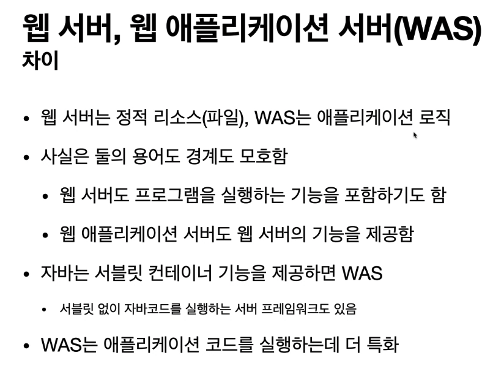

### 웹 서버, 웹 애플리케이션 서버

1. 웹 서버, 웹 애플리케이션 서버
   - 모든 것이 HTTP
     1. HTML, TEXT
     2. IMAGE, 음성, 영상, 파일
     3. JSON, XML(API)
     4. 거의 모든 형태의 데이터 전송 가능
     5. 서버 간에 데이터를 주고 받을 때도 대부분 HTTP 사용
     6. 지금은 HTTP 시대!

2. 웹 서버(Web Server)

   - HTTP 기반으로 동작
   - 정적 리소스 제공, 기타 부가기능
   - 정적(파일) HTML, CSS, JS, 이미지, 영상
   - 예) NGINX, APACHE

   

3. 웹 애플리케이션 서버(WAS - Web Application Server)

   - HTTP 기반으로 동작
   - 웹 서버 기능 포함 + (정적 리소스 제공 가능)
   - 프로그램 코드를 실행해서 애플리케이션 로직 수행
     1. 동적 HTML, HTTP API(JSON) : 사용자에 따라 다른 화면을 보여줄 수 있음
     2. 서블릿, JSP, 스프링MVC
   - 예) 톰캣(Tomcat), Jetty, Undertow

   

4. 웹 서버 VS 웹 애플리케이션 서버

   

5. 웹 시스템 구성 - WAS, DB

   - WAS, DB만으로 시스템 구성 가능
   - WAS는 정적 리소스, 애플리케이션 로직 모두 제공 가능

   

   - WAS가 너무 많은 역할을 담당, 서버 과부하 우려
   - 가장 비싼 애플리케이션 로직이 정적 리소스 때문에 수행이 어려울 수 있음
   - WAS 장애시 오류 화면도 노출 불가능

   

   - 정적 리소스는 웹 서버가 처리
   - 웹 서버는 애플리케이션 로직같은 동적인 처리가 필요하면 WAS에 요청을 위임
   - WAS는 중요한 애플리케이션 로직 처리 전담

   

   - 효율적인 리소스 관리
     1. 정적 리소스가 많이 사용되면 Web 서버 증설
     2. 애플리케이션 리소스가 많이 사용되면 WAS 증설

   

   - 정적 리소스만 제공하는 웹 서버는 잘 죽지 않음
   - 애플리케이션 로직이 동작하는 WAS 서버는 잘 죽음
   - WAS, DB 장애 시 WEB 서버가 오류 화면 제공 가능

   

   ***

   자료출처 : 인프런 스프링 MVC 1편 - 백엔드 웹 개발 핵심 기술

